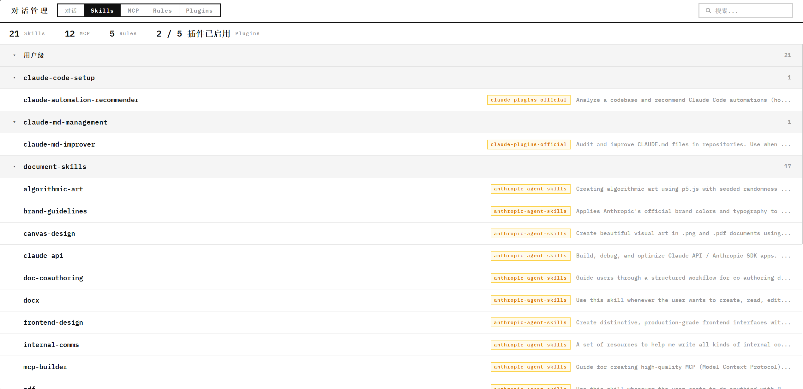

# Session Manager

管理 Claude Code 和 OpenAI Codex 对话记录，以及 Claude Code 配置（Skills、MCP、Rules、Plugins）的本地 Web 应用。

## 功能特性



### 对话管理

- 统一查看 Claude Code 和 OpenAI Codex 的所有对话记录
- 按来源筛选：全部 / 仅 Claude / 仅 Codex / 仅收藏
- 三种分组方式：按项目、按时间（今天/昨天/本周/本月/更早）、按模型
- 分页浏览，每页 50 条（可调）
- 每个分组默认展开，点击分组标题可折叠/展开
- 全文搜索：同时搜索对话标题、消息内容和备注
- 点击对话进入全屏详情视图，隐藏仪表盘
- 消息下方显示紧凑信息行：工具调用名称、思考过程、Token 用量、时间戳
- 点击信息行可展开查看工具调用参数、返回结果、思考过程全文
- 查看子代理（Subagent）调用记录
- 导出对话为 Markdown / JSON 格式
- 全量导出（JSON 流式 / ZIP 打包），支持选中导出
- 删除对话至系统回收站
- 批量操作：右键进入批量模式，全选/批量删除/批量导出
- 统计面板：对话数、消息数、Token 总量、常用工具
- 趋势图表：Session 数量折线图、来源分布饼图（Chart.js）

### 收藏与备注

- ⭐ 收藏对话：点击对话行左侧星标，支持按收藏筛选
- 📝 备注功能：对话详情页点击"备注"按钮添加笔记
- 备注在列表行右侧以标签形式显示，鼠标悬停预览全文
- 搜索时自动匹配备注内容

### Skills 管理

- 查看所有已安装的 Skills，按用户级/项目级分组
- 每组内按插件名分组，显示 Skill 名称、描述、来源市场
- 点击 Skill 查看完整 SKILL.md 内容（Markdown 渲染）
- 只显示已安装版本，自动过滤旧缓存避免重复

### MCP 服务器管理

- 查看所有配置的 MCP 服务器，按用户级/项目级分组
- 显示传输类型（stdio/http/sse）、命令或 URL
- 用户级来自 `~/.claude/plugins/marketplaces/` 和 `settings.json`
- 项目级来自项目目录下的 `.mcp.json` 和 `settings.local.json`

### Rules 管理

- 查看所有规则文件，按用户级/项目级分组
- 用户级：`~/.CLAUDE.md`
- 项目级：各项目的 `CLAUDE.md` 和 `.claude/settings.local.json`
- 点击规则查看完整文件内容
- 支持在线编辑规则并保存

### Plugins 管理

- 查看所有已安装插件，按用户级/项目级分组
- 每组内按市场来源分组
- 显示启用/禁用/封锁状态、Skill 数量、描述
- 统计面板显示已启用插件数量

### 界面特性

- **暗色模式**：点击右上角 ☀/☾ 切换，偏好保存在 localStorage
- **实时更新**：SSE 推送新 session 创建通知
- **Toast 通知**：操作成功/失败的即时反馈
- **错误处理**：所有 API 调用统一错误捕获和展示

### 键盘快捷键

| 按键 | 功能 |
|------|------|
| `Ctrl+K` | 聚焦搜索框 |
| `Escape` | 清空搜索并失焦 / 退出批量模式 / 从详情视图返回列表 |

---

## 安装

```bash
pip install -r requirements.txt
```

依赖项：
- `fastapi` >= 0.115.0
- `uvicorn` >= 0.34.0
- `jinja2` >= 3.1.0
- `send2trash` >= 1.8.0
- `pydantic` >= 2.0.0

## 运行

```bash
python main.py
# 或双击 start.bat
```

启动后自动打开浏览器访问 `http://127.0.0.1:8765`。

如果端口被占用，先查找并关闭进程：

```bash
netstat -ano | grep ":8765"
taskkill //F //PID <进程ID>
```

---

## 数据来源

### 对话记录

- **Claude Code**：`~/.claude/projects/<编码路径>/<uuid>.jsonl`，两遍扫描解析
- **OpenAI Codex**：`~/.codex/state_5.sqlite` + rollout JSONL 文件

### Skills

- 路径：`~/.claude/plugins/cache/<市场>/<插件>/<版本>/skills/<名称>/SKILL.md`
- 只读取 `installed_plugins.json` 中已安装的版本，避免旧缓存重复
- 解析 YAML frontmatter（name、description、license）

### MCP 服务器

- 用户级：`~/.claude/plugins/marketplaces/*/external_plugins/*/.mcp.json` + `settings.json` mcpServers
- 项目级：项目目录下 `.mcp.json` + `.claude/settings.local.json` mcpServers
- 支持三种传输类型：stdio（命令行）、http（远程）、sse（Server-Sent Events）

### Rules

- 用户级：`~/.CLAUDE.md`
- 项目级：`<项目>/CLAUDE.md` + `<项目>/.claude/settings.local.json`

### Plugins

- 已安装插件：`~/.claude/plugins/installed_plugins.json`
- 启用状态：`~/.claude/settings.json` enabledPlugins
- 封锁列表：`~/.claude/plugins/blocklist.json`
- 插件元数据：`<安装路径>/.claude-plugin/plugin.json`

### 收藏与备注

- 收藏：`~/.claude/session_manager_data/favorites.json`
- 备注：`~/.claude/session_manager_data/notes.json`

---

## 页面操作指南

### 导航栏

顶部导航栏有五个标签：**对话**、**Skills**、**MCP**、**Rules**、**Plugins**。点击切换不同视图。右上角可切换暗色/亮色主题。

### 对话视图

1. **筛选来源**：点击 "全部" / "Claude" / "Codex" / "收藏" 按钮
2. **切换分组**：点击 "项目" / "时间" / "模型" 按钮
3. **折叠分组**：点击分组标题栏
4. **搜索**：在搜索框输入关键词（匹配标题、消息内容、备注）
5. **翻页**：底部页码按钮
6. **进入对话**：点击任意对话行，进入全屏详情
7. **返回列表**：点击 "返回" 按钮或按 `Escape`
8. **收藏**：点击对话行左侧 ☆/★
9. **备注**：对话详情页点击 "备注" 按钮
10. **批量操作**：右键列表进入批量模式，勾选后批量删除/导出
11. **导出全部**：批量模式下点击 "导出全部"

### 配置视图（Skills / MCP / Rules / Plugins）

1. 所有配置视图按 **用户级** / **项目级** 分组
2. 点击分组标题栏可折叠/展开
3. Skills 和 Plugins 有二级分组（按插件名/市场来源）
4. 点击 Skill 或 Rule 可查看详情内容
5. Rule 详情页支持在线编辑
6. 搜索框在所有标签页下可用

---

## API 接口

### 对话

| 方法 | 路径 | 说明 |
|------|------|------|
| `GET` | `/api/stats` | 获取统计数据 |
| `GET` | `/api/sessions?source=&q=&page=&per_page=&favorites=` | 列出/搜索/筛选对话 |
| `GET` | `/api/sessions/{source}/{id}` | 获取对话消息 |
| `GET` | `/api/sessions/{source}/{id}/subagents` | 获取子代理列表 |
| `GET` | `/api/sessions/{source}/{id}/export?format=markdown\|json` | 导出对话 |
| `GET` | `/api/sessions/{source}/{id}/note` | 获取备注 |
| `PUT` | `/api/sessions/{source}/{id}/note` | 保存备注 |
| `POST` | `/api/sessions/delete-batch` | 批量删除 |
| `DELETE` | `/api/sessions/{source}/{id}` | 删除单个对话 |
| `GET` | `/api/sessions/export-all?format=json\|markdown&ids=` | 全量/选中导出 |

### 收藏

| 方法 | 路径 | 说明 |
|------|------|------|
| `GET` | `/api/favorites` | 获取收藏列表 |
| `POST` | `/api/favorites/{source}/{id}` | 切换收藏状态 |

### 备注

| 方法 | 路径 | 说明 |
|------|------|------|
| `GET` | `/api/notes` | 获取全部备注 |

### 配置管理

| 方法 | 路径 | 说明 |
|------|------|------|
| `GET` | `/api/config/stats` | 配置统计 |
| `GET` | `/api/skills?q=` | 技能列表 |
| `GET` | `/api/skills/{id:path}/body` | 技能全文 |
| `GET` | `/api/mcp?q=` | MCP 服务器列表 |
| `GET` | `/api/rules?scope=&q=` | 规则列表 |
| `GET` | `/api/rules/{id:path}/content` | 规则全文 |
| `PUT` | `/api/rules/{id:path}/content` | 更新规则内容 |
| `GET` | `/api/plugins?q=` | 插件列表 |

### 实时更新

| 方法 | 路径 | 说明 |
|------|------|------|
| `GET` | `/api/events` | SSE 事件流（session 变更通知） |

---

## 技术架构

```
对话数据:
~/.claude/projects/<path>/<uuid>.jsonl   → ClaudeParser (带 session 索引)
~/.codex/state_5.sqlite + rollout JSONL  → CodexParser (SQL WHERE id)
                                              ↓
                                       SessionService (统一缓存)
                                              ↓
配置数据:
~/.claude/plugins/cache/.../SKILL.md     → SkillsParser
~/.claude/plugins/marketplaces/.../.mcp.json → McpParser
~/.CLAUDE.md + 项目/CLAUDE.md            → RulesParser
~/.claude/plugins/installed_plugins.json  → PluginsParser
                                              ↓
                                       ConfigService (统一缓存 + invalidate)
                                              ↓
持久化数据:
~/.claude/session_manager_data/          → Storage (favorites + notes)
                                              ↓
                                         FastAPI (/api/*)
                                         SSE background task
                                              ↓
                                    单页应用 (HTML + CSS + JS + Chart.js)
```

- **后端**：FastAPI + Pydantic（Field default_factory），无数据库，直接解析文件
- **前端**：原生 HTML/CSS/JS，无框架，无构建步骤
- **字体**：IBM Plex Mono（等宽）
- **样式**：CSS 变量驱动，支持亮色/暗色主题切换
- **错误处理**：精确异常类型 + logging，无静默吞掉
